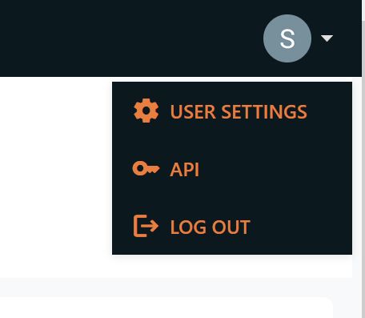
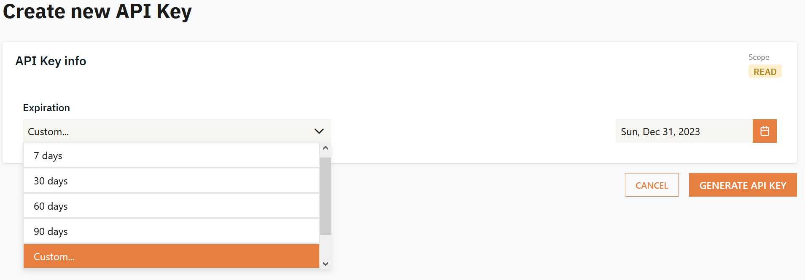
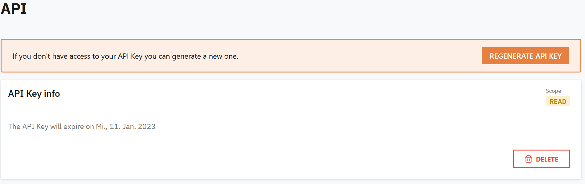

# Obtain an API-Key for the first time
1. Login to Dataland.
2. Navigate to your user drop down (top right corner) and select "API".  
  
3. On the upcoming page select "CREATE NEW API KEY".
4. Select the desired expiration time (selecting "Custom" enables a date picker to choose the desired date) and click "GENERATE API KEY".  
  
5. From the upcoming page copy the displayed API-Key and safely store it. In terms of security it should be treated like a password.

# Revoke/Regenerate an API-Key
1. Login to Dataland.
2. Navigate to your user drop down (top right corner) and select "API".
3. On the upcoming page either press "DELETE" in order to revoke your API-Key or "REGENERATE API KEY" to overwrite your existing one.  
  
