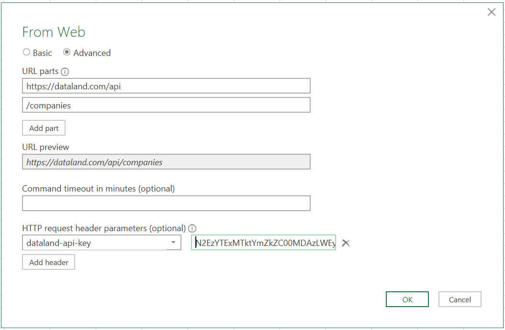

# Using the API Key via Excel
1. Open Excel and navigate to: Data &rarr; From Web
2. Select "Advanced" and enter the endpoint you want to query in "URL parts". The base URL is "https://dataland.com/api" or "https://test.dataland.com/api" if you want to query the test instance. Depending on what endpoint is to be used the other URL parts have to be filled appropriately. To retrieve e.g. company information the additional URL part would be simply "companies".
3. Add the string "dataland-api-key" in the left "HTTP request header parameters" field.
4. Add your API key in the right "HTTP request header parameters" field. If you do not have an API key yet, you may obtain one as described [here](ApiKeyDocumentation.md). An example for the filled out form is given below:   
  
5. After clicking "Ok" a Power Query Editor window will open displaying the retrieved data.
