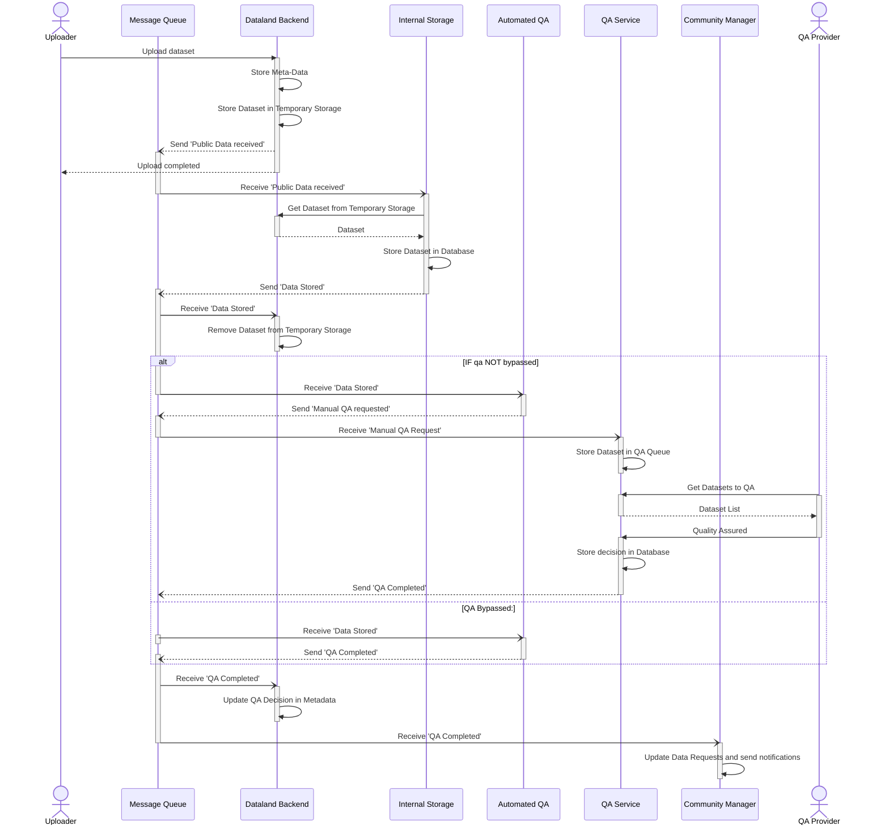

# Dataland Data Upload And QA Process (Technical)
| Metadata        | Value                                                                                                                                                                                                                   |
|-----------------|-------------------------------------------------------------------------------------------------------------------------------------------------------------------------------------------------------------------------|
| Target Audience | Dataland Developers                                                                                                                                                                                                     |
| Abstract        | This document describes the process of uploading data to Dataland and the QA process that follows. It focuses on any messages that are sent via the message-queue. It is limited to **public** datasets (i.e., no VSME) |

The following diagram describes the process of uploading data to Dataland and the QA process that follows. It focuses on any messages that are sent via the message-queue.
Please note that all message-queue events are asynchronous and are not necessarily in the order they are shown in the diagram.

